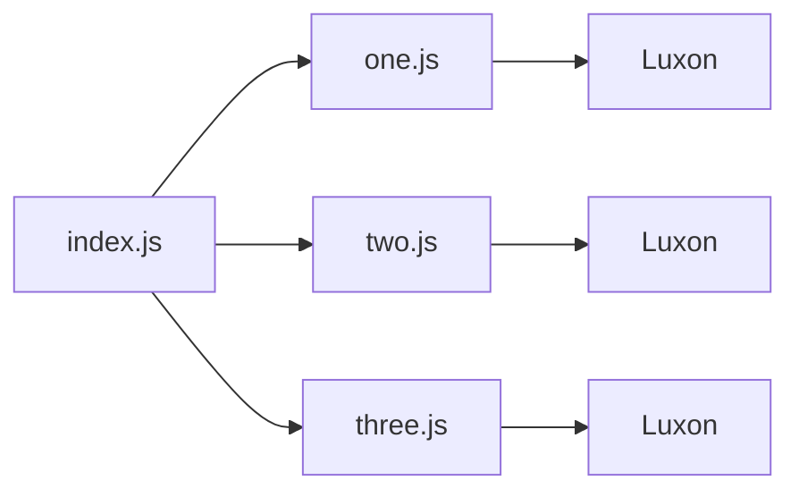
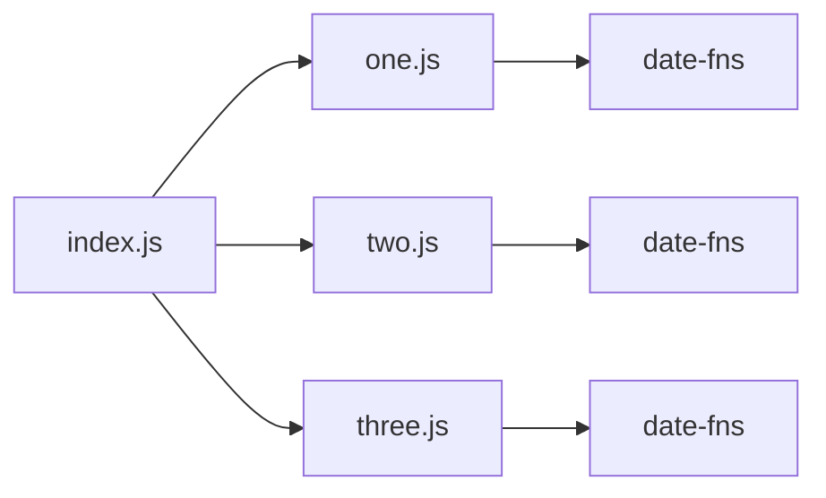
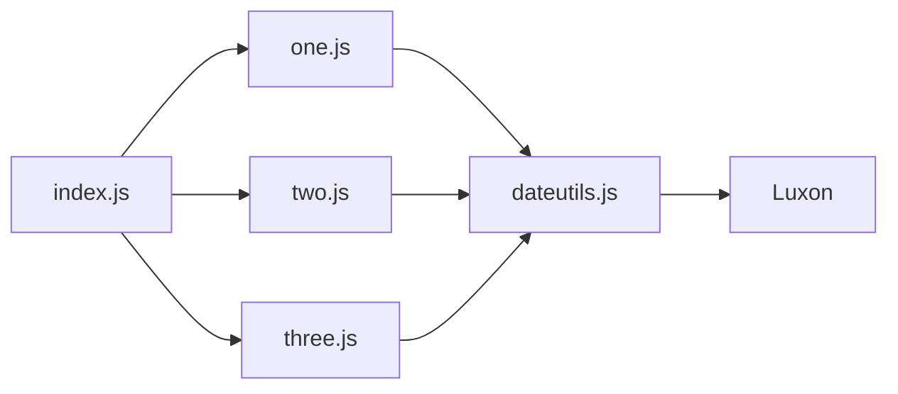
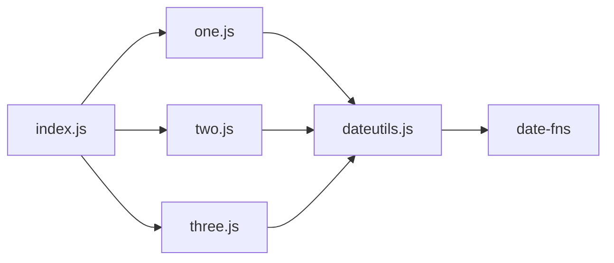

# Abstract libs

When pulling in third-party libraries that will be used in many different places across your app, it can be a good idea to wrap the library in a layer owned by your app. This is especially useful if you plan on eventually swapping the library for another one in the future.

Below is an example where no additional layer exists. Each component (one, two, and three) makes use of the library (Luxon for date management in this example) directly. This code can be seen in the `master` git branch.

To switch out date libraries, you'd have to change the code in at least three places: `one.js`, `two.js`, and `three.js`.

This time, we've added a layer (`dateutils.js`) between the components that use the library. So, all three components depend on `dateutils.js` and it depends on the date library directly. This code can be seen in the `abstracted` git branch.

When the time comes to swap out the date library (Luxon to date-fns), we'll always only have to make the change in a single touchpoint, `dateutils.js`.

